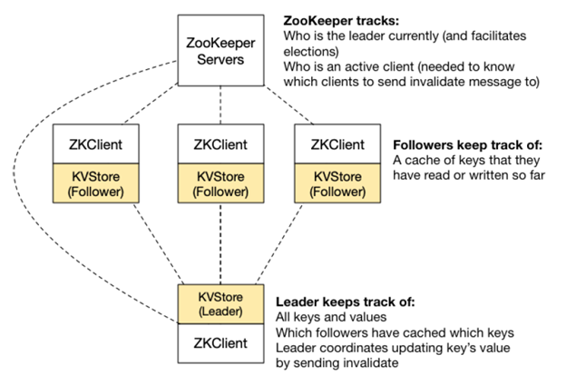

# KVStore
Distributed KVStore with high consistency, fault tolerance and partition awareness.

** NOTE: Source has been made private. Please contact pschemer if interested in collaboration or review.

The design of this system has the following goals in mind:

1. **Consistency:** Key/value pairs can be created by any node. Any node can query the system to find the current value of a key. Replication will be sequentially consistent: no node will be able to read an out-of-date value.
2. **Fault tolerance:** The system overall will tolerate a simultaneous failure of a minority of nodes. Any data that was held only by those nodes will be lost, but the system will otherwise continue to function.
3. **Partition awareness:** If a participant becomes aware that it is in a minority partition, it will cease to operate and abort any pending operations.

Distributed key-value store with a rotating leader that is in charge of coordinating writes. The primary role of the leader is to keep track of (1) all of the keys and their values and (2) which nodes have a copy of each key. When a key&#39;s value is updated, the leader will notify all clients (i.e. followers) that have a copy of that key to invalidate their cache. The primary reason why we have designated a single node as the lock server in the past is because it eliminates the need for all of our replicas to come to some mutual agreement between each other about who the lock server (leader) is. Now, we will allow any replica to be the leader, and use ZooKeeper to perform this coordination between replicas so that they can establish which is the leader at any given point. Of course, if two replicas were to simultaneously consider themselves leader, then this would be bad, since each would assume it had free rein to perform updates.

The architecture of the new key-value store is shown below. Zookeeper (top) will help with the consensus elements of the assignment. I implement the ZKClients (leader/follower). The key-value store will expose just two simple operations to the end-user of the Kev Value Store: getValue(String key) and setValue(String key, String value).

To compile and run the provided testing shell, run mvn -DskipTests package in the top level directory and then run java -jar target/kvstore-2020.4.5-SNAPSHOT.jar to start the KV server. Just run the jar once: it will create a ZooKeeper and a client. To createmore clients, use the new-client command in the shell. Provided help command which lists the provided commands:

AVAILABLE COMMANDS

get: Get a key

list: List clients

new-client: Create a new client

put: Set a key

rmi-down: Disable a client&#39;s inbound RMI services

rmi-up: Resume a client&#39;s inbound RMI services

zk-down: Disable a client&#39;s access to ZooKeeper

zk-up: Resume a client&#39;s access to ZooKeeper

Since this single CLI will be a front-end for multiple clients, you&#39;ll need to include the client ID in each command, e.g. get 0 foo will issue the getValue command to client 0. The put 1 foo bar command will invoke setValue on client 1. We&#39;ve also provided commands that you can use to simulate a service failing: either disabling a client&#39;s connection to ZooKeeper, or blocking other clients from talking to it over RMI.
